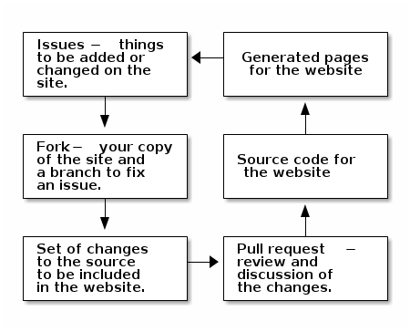

There are a few ways to contribute. At the moment, this all works via the
_source code_ platform: GitHub. If you're not familiar with GitHub, we hope
this page provides an introduction.

You can contribute in various ways:

* Report a problem or suggest an improvement.
* Send a request to include your contribution.

We'll outline the process, and gradually introduce you to become an _open source
contributor_!

# Overview of the work flow

All errors and suggestions for improvements of the website can be recorderd as
_issues_. Issues can be organised with _tags_.

The issue can be assignd to someone, who is then overseeing that the error is
fixed or the suggestion discussed and incorporated.

The work itself is done in a copy of the website (in GitHub terms: you _fork_
our repository to have your own copy, and then you can create a _branch_ to
keep all the work related to a single issue separated from work on other
issues.

Eventually, you want to offer your work for inclusion in our repository. For
that, you create a _pull request_. This makes it possible for others to review
your changes, to perhaps further improve it.

When the _pull request_ is accepted, it can be _merged_ into the source code
of the website, and a new version of the website will be generated from that!

# How to

Pick what you like to do:

* [How to set up my GitHub account](setup-github.html)
* [How to see what we are working on](see-our-work.html)
* [How to report an issue](report-an-issue.html)
* [How to create my own copy (_fork_) of the website?](fork.html)
* [How to submit my work (_pull request_)](make-a-pull-request.html)
