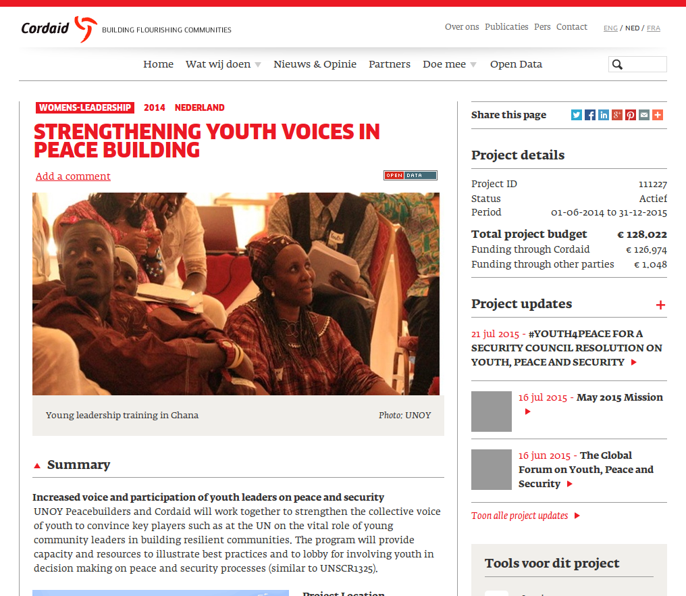


<!-- first column -->


# 0 to IATI in 15 minutes

<aside class="notes">

A very quick introduction into producing IATI files

The main goal of IATI is to move from a complex system of producing different
data sets and reports for each use...
</aside>








<!-- next column -->



# IATI Standard

## Goal

- Exchange information on development activities

## Who

- Multi-stakeholder: donors, NGOs, recipients, watch dogs

## Evolving

- Version 1.01 in February 2011
- Version 1.04 in May 2014
- Version 2.01 in January 2015



from presentation...



...to raw data

~~~xml
<iati-activity default-currency="EUR"
  last-updated-datetime="2015-02-12T09:09:25+00:00" xml:lang="en">
  <iati-identifier>NL-KVK-41160054-111227</iati-identifier>
  <title>Strengthening youth voices in peace building</title>
  <description type="1">Increased voice and participation of youth leaders on
    peace and security</description>
  <description type="1">UNOY Peacebuilders and Cordaid will work together to
    strengthen the collective voice of youth to convince key players such as at
    the UN on the vital role of young community leaders in building resilient
    communities. The program will provide capacity and resources to illustrate
    best practices and to lobby for involving youth in decision making on peace
    and security processes (similar to UNSCR1325).</description>
  <activity-status code="2">Implementation</activity-status>
  <activity-date  iso-date="2014-06-01" type="start-planned"/>
  <activity-date  iso-date="2015-12-31" type="end-actual"/>
  <reporting-org ref="NL-KVK-41160054" type="21">Stichting Cordaid
  </reporting-org>
  <participating-org ref="NL-1" role="Funding" type="10">Dutch Ministry of
    Foreign Affairs</participating-org>
  <participating-org role="Implementing" type="21">UNOY Peacebuilders
  </participating-org>
  <participating-org ref="NL-KVK-41160054" role="Accountable" type="21">Cordaid
  </participating-org>
  <budget type="1">
    <period-start  iso-date="2014-06-01"/>
    <period-end  iso-date="2015-12-31"/>
    <value value-date="2014-06-01">126974</value>
  </budget>
  <budget type="1">
    <period-start  iso-date="2014-06-01"/>
    <period-end  iso-date="2015-12-31"/>
    <value value-date="2014-06-01">1048</value>
  </budget>
  <!-- ... -->
</iati-activity>
~~~
{: .stretch}




<!-- next column -->



# How?



# Steps to take

## Start

- Implementation schedule

## Scope and planning

## Getting the data in shape

## Publish

- Organisation and Activities files



# Next...

## Ok, I have an Activities File. Now what?

{: .col-md-5}
{: .col-md-6 .col-md-offset-1}



<!-- close columns -->
