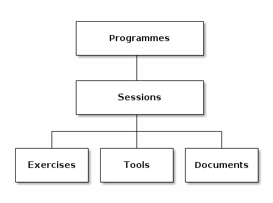

This is a repository of materials to build your own "IATI Implementation Support Programme"
or to find ready-made workshops, presentations, and documents.

The information is organised in a few layers:

## Programme

A Programme is a set of activities and support as used by, for instance, a
national NGO platform, to help their members understand and implement IATI.

A Programme is typically funded by the Ministry in a country, as part of making
reporting via IATI data a condition in grants.

## Session

A session is a single event or activity undertaken as part of a programme.
This can be in various forms, for example as a workshop, a webinar, or
an advice session.

A session brings together exercises, tools and documents, to achieve a particular goal.

## Exercises, documents, tools

Each session can be made up of three types of components:

### Exercise

This is a part of a workshop, a "scripted event" with associated materials.

It could be a game, a discussion, an ice breaker, and so on.

### Tool

This is a tool or service, such as AidStream, the CSV convertor, and so on.

### Document

This can be a paper, one-pager, background document, presentation, and so on.
